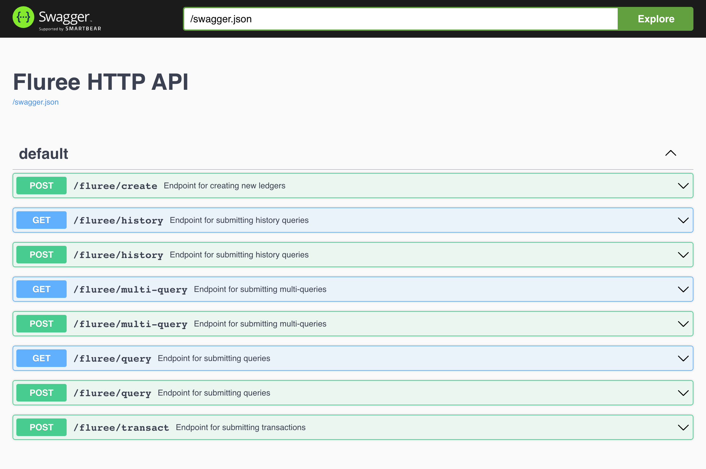

# Fluree 3 HTTP API server

## Overview

[Fluree](https://flur.ee/) is an open-source JSON-LD graph database with
fine-grained cryptographic security written in [Clojure](https://clojure.org/).
This project provides an HTTP interface for the database, letting you perform
the database's core API functions via HTTP calls. This makes the database usable
from any programming language that supports HTTP.

There are many other ways to run Fluree, including by embedding it directly in a
frontend javascript application. The HTTP API server is your best choice if
you're looking to use Fluree in a manner similar to traditional databases like
MySQL and Postgres.

See [the Fluree
tutorial](https://next.developers.flur.ee/docs/learn/tutorial/introduction/) for
instructions on storing and querying data.

## Starting a server

This project is currently in alpha. It's suitable to be run in non-production
environments, to learn Fluree and engage with the community.

There are two ways to start the HTTP server: with the Clojure command-line tool
or with docker.

### Clojure

After [installing the Clojure CLI](https://clojure.org/guides/install_clojure),
run this:

``` sh
git clone git@github.com:fluree/http-api-gateway.git
cd http-api-gateway
clojure -M -m fluree.http-api.system [server-profile]
```

Possible values for [`server-profile`](#server-profiles-and-configuration) include `dev` and
`prod`. There's also a shortcut for running with the `dev` profile:

``` sh
clojure -X:run-dev
```

The output should read something like:

``` sh
Fluree HTTP API server running on port 58090
```

### Docker

You can build a Docker image of this project by running:

``` sh
docker buildx build -t fluree/http-api-gateway:[docker-image-version]
```

And then run it with:

``` sh
docker run -p 8090:8090 \ 
  -v /local/dir:/opt/fluree-http-api-gateway/data \ 
  fluree/http-api-gateway:[docker-image-version] [server-profile]
```

[`server-profile`](#server-profiles-and-configuration) defaults to `docker` but
can also be set to `dev`.

### Server Profiles and configuration

You can specify a _server-profile_ when starting the server. A server profile
specifies configuration values for the server, like what port to run on.

Possible values include:

* `dev`
* `docker`
* `prod`

The configuration can be further tuned with environment variables. See
[resources/config.edn](resources/config.edn) for all config options and their
environment varaibles. Environment variables are in all caps and have a `#env`
in front of them.

## API

Pull up the root URL of this server in a web browser for Swagger docs of the
API. I.e. if it says it's running on port 8090, browse to
http://localhost:8090/. You should see something like this:



## Tests

`clojure -X:test` runs the test suite.

## Contributing

TODO

* Guidelines
* Community

## Related Projects

* [Fluree DB](https://github.com/fluree/db)
